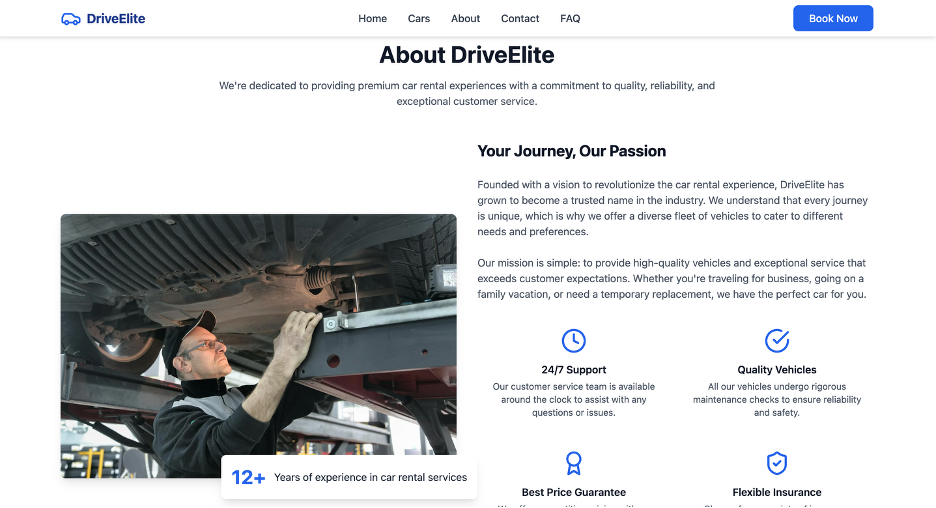

Live Website: https://thekabir.shop
Video explainer : https://drive.google.com/file/d/1k7FUR_rYQ9TGpeFepOVtitOU3sHaj4YV/view?usp=drive_link
- Student Name: Kabir Singh
- Student ID: 34969497

<hr>

## Introduction

This documentation details the deployment process of a cloud server hosted on an Azure Virtual Machine (VM). The application provides a login interface, demonstrating basic web server setup and configuration. This guide covers the VM creation, environment setup, Node.js installation, process management using pm2, and configuring Nginx as a reverse proxy for secure and reliable access.

## Azure VM Creation

The VM was provisioned via the Azure Portal with the following configuration:

- Subscription: Azure for Students
- Resource Group: Test (New)
- Virtual Machine Name: login-app-vm
- Region: (US) West US 2
- Availability Options: Availability Zone (Self-selected zone: Zone 1)
- Security Type: Trusted launch virtual machines
- Image: Ubuntu Server 22.04 LTS - x64 Gen2
- VM Architecture: x64

## Important Settings

- SSH port 22 and HTTP port 80 inbound rules were enabled to allow remote connection and web traffic.
- A key pair was generated for SSH authentication during creation.

## Screenshot: Azure VM Creation Portal

Creating the Virtual Machine

- Navigated to Azure Portal and selected "Create a resource" > "Virtual Machine"
- Selected Ubuntu 22.04 LTS as the operating system image
- Configured basic VM settings (size, region, authentication type)
- Chose SSH public key authentication for secure access

After deployment, connected to the VM using SSH with the private key:


Azure portal showing VM creation options with Ubuntu 22.04 LTS image selected.


## Accessing the VM via SSH

Once the VM was deployed, access was established using SSH with the VM's public IP address.
ssh -i /path/to/private-key.pem azureuser@<public-ip-address>
Replace /path/to/private-key.pem with the path to your downloaded private SSH key and <public-ip-address> with the VM's IP.

## Terminal showing successful login to Azure VM via SSH.


## Installing Node.js and npm

Node.js v18.x and npm were installed using the official NodeSource setup script.

```
curl -fsSL https://deb.nodesource.com/setup_18.x | sudo -E bash -
sudo apt-get install -y nodejs
```

Verify installation:

```
node -v
npm -v
```

Browser view of the page served by the React application.





## Managing the Application with pm2

To ensure continuous uptime and automatic restarts on crashes or VM reboot, the pm2 process manager was installed and configured.

```
sudo npm install -g pm2
pm2 start app.js --name my-webapp
pm2 save
pm2 startup
```

Follow the instructions printed by pm2 startup to enable startup scripts.

Configuring Nginx as a Reverse Proxy
Nginx was installed and configured to forward HTTP requests on port 80 to the Node.js application running on port 3000.
Installation
sudo apt-get install nginx -y

## Nginx Configuration

Create a new config file /etc/nginx/sites-available/
my-webapp:

```
server {
listen 80;
server_name <public-ip-address>;

    location / {
        proxy_pass http://localhost:3000;
        proxy_http_version 1.1;
        proxy_set_header Upgrade $http_upgrade;
        proxy_set_header Connection 'upgrade';
        proxy_set_header Host $host;
        proxy_cache_bypass $http_upgrade;
    }

}
```

Enable site and restart Nginx:

```
sudo ln -s /etc/nginx/sites-available/my-webapp /etc/nginx/sites-enabled/
sudo nginx -t
sudo systemctl restart nginx
sudo ufw allow 'Nginx Full'
```


## Testing the Application

The application was tested by navigating to the VM's public IP address in a web browser, confirming the login page loads and can accept inputs.

## Troubleshooting & Notes

- The application initially ran on port 80, which requires root privileges. Moving it to port 3000 and proxying with Nginx avoids this requirement.
- Firewall and Azure Network Security Group rules must allow ports 22 (SSH) and 80 (HTTP).
  pm2 ensures the Node.js process restarts on VM reboot or failure.
- SSH key management: Store private keys securely as Azure does not store the private key after generation.

## Server Information

### OS Information

| Property       | Value              |
| -------------- | ------------------ |
| Distributor ID | Ubuntu             |
| Description    | Ubuntu 22.04.5 LTS |
| Release        | 22.04              |
| Codename       | jammy              |
| Kernel Version | 6.8.0-1029-azure   |

### Software Versions

| Software | Version               |
| -------- | --------------------- |
| Node.js  | v18.20.8              |
| npm      | 10.8.2                |
| pm2      | 6.0.6                 |
| Nginx    | nginx/1.18.0 (Ubuntu) |

### Firewall Status

| Property       | Value                                                |
| -------------- | ---------------------------------------------------- |
| Status         | active                                               |
| Logging        | on (low)                                             |
| Default Policy | deny (incoming), allow (outgoing), disabled (routed) |
| Allowed Ports  | 80, 22, 443 (TCP) - Both IPv4 and IPv6               |

### Network Information

| Property           | Value                        |
| ------------------ | ---------------------------- |
| Azure VM Public IP | 52.247.228.100               |
| Last Updated       | Thu May 29 20:10:19 UTC 2025 |

### Firewall Rules Detail

| Port/Service      | Action   | Scope                 |
| ----------------- | -------- | --------------------- |
| 80                | ALLOW IN | Anywhere              |
| 22                | ALLOW IN | Anywhere              |
| 80,443/tcp        | ALLOW IN | Anywhere (Nginx Full) |
| 80 (IPv6)         | ALLOW IN | Anywhere              |
| 22 (IPv6)         | ALLOW IN | Anywhere              |
| 80,443/tcp (IPv6) | ALLOW IN | Anywhere              |

## Conclusion

This documentation outlines the steps taken to deploy a server on an Azure Ubuntu VM. The use of pm2 and Nginx ensures process resilience and secure web access. This setup can be recreated reliably using this documentation in case of accidental deletion or migration needs.
